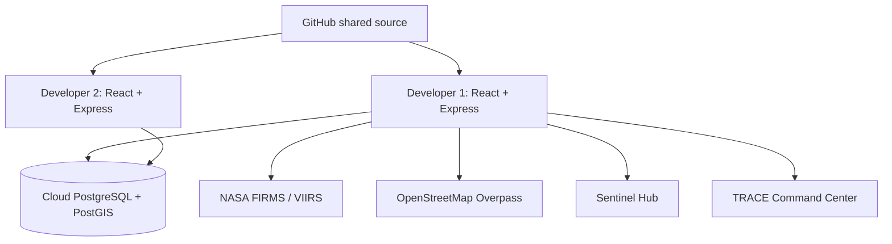
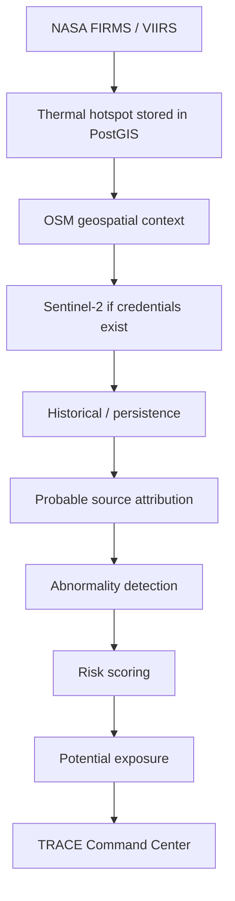

# TRACE Architecture

TRACE is a single Express API plus a Vite React app. There are no microservices, queues, or containers in the MVP.

## Runtime

- Frontend: `http://localhost:5173` (proxies `/api` to Express)
- Backend: `http://localhost:5000`
- Database: shared `DATABASE_URL` only (never localhost for team work)
- Secrets stay on the backend: `DATABASE_URL`, `NASA_FIRMS_MAP_KEY`, Sentinel credentials

## Pipeline

## Demo resilience

If FIRMS, Overpass, or Sentinel is unavailable, TRACE still runs:

- `DEMO_MODE=true` or **Switch to Demo Mode** uses `backend/data/demo_firms_chennai.csv`
- Overpass failures fall back to bundled Chennai context features
- Missing Sentinel credentials return `{ available: false }` instead of crashing

## Honesty

TRACE is decision support. It does not confirm fire cause, exact location, or damage. Language in the product is thermal anomaly, probable source, attribution confidence, and potential exposure.
